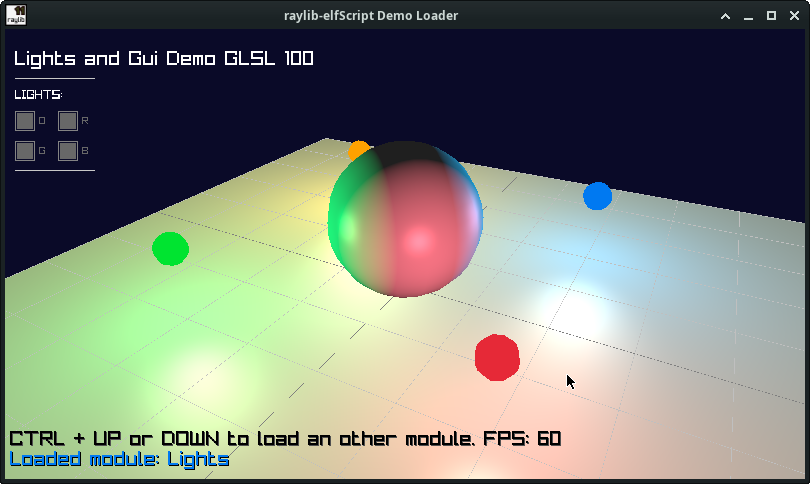
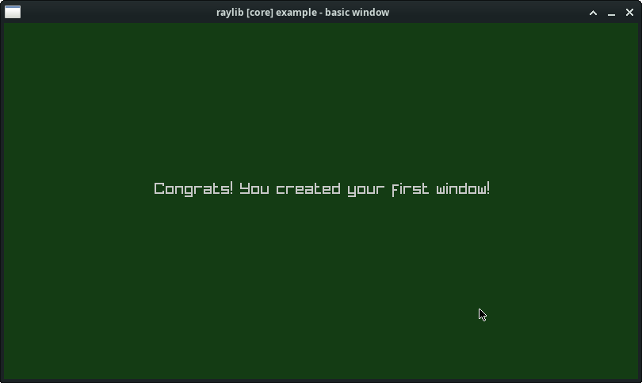

# raylib-elfscript 
 
This is an MIT-licensed ElfScript (aka TorqueScript) binding for Raylib 6.0.

- [ElfScript](https://github.com/ohmtal/ElfScript)
- [raylib](https://github.com/raysan5/raylib)

This is the base which will be used in:

- [ElfFlux](https://github.com/ohmtal/ElfFlux)


## Setup: 

I usually have the TorqueScript Source in "/opt/TorqueScript" which is set as default in CMake. 
But you can also put it somewhere else and need to add the path to cmake like:

    git pull https://github.com/ohmtal/TorqueScript.git

and then

    cd demo
    cmake -S . -B build -DELFSCRIPT_PATH="/whereIHaveMySource/TorqueScript"
    cmake --build build
    ./raylib-elfscript


    
## Lights Demo


    
## First Script assets/main.cs

If you wonder why the the script file ends with .cs. This is not CSharp it's CScript (back from 1999).



There are three functions called from the C Code to get it working:

    - function MainInit() { return true;}
    - function MainLoop() {}
    - function MainShutDown() {}
    
The Script is:

```
function MainInit() {
    // Initialization
    //--------------------------------------------------------------------------------------
    $screenWidth = 800;
    $screenHeight = 450;

    InitWindow($screenWidth, $screenHeight, "raylib [core] example - basic window");

    SetTargetFPS(60);               // Set our game to run at 60 frames-per-second

    return true;
}

function MainShutDown() {
    // De-Initialization
    //--------------------------------------------------------------------------------------
    CloseWindow();        // Close window and OpenGL context
    //--------------------------------------------------------------------------------------
}

function MainLoop()
{
    // Update
    //----------------------------------------------------------------------------------
    // nothing todo here ;)
    
    // Draw
    //----------------------------------------------------------------------------------
    BeginDrawing();
      ClearBackground("20 60 20");
      DrawText("Congrats! You created your first window!", 190, 200, 20, "200 200 200 255");
    EndDrawing();

}

```
    
