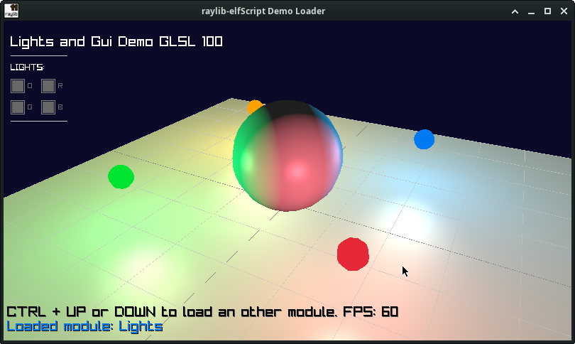
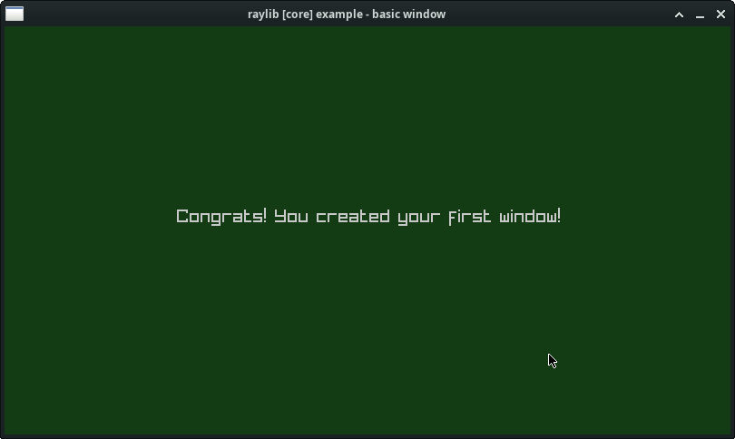

# raylib-elfscript 
 
This is an MIT-licensed ElfScript (aka TorqueScript) binding for Raylib 6.0.

- [ElfScript](https://github.com/ohmtal/ElfScript)
- [raylib](https://github.com/raysan5/raylib)

## Build and Run: 
```
cmake -S . -B build 
cmake --build build 
./raylib-elfscript
```

## Version 0.8

- moved Bindings to [ElfScript/addons/raylib/](https://github.com/ohmtal/ElfScript/tree/main/ElfScript/addons/raylib)
- Removed Events. Main loop is now like in C with `while (!WindowShouldClose()) ...` 


    
## Lights Demo


    
## First Script assets/main.cs

If you wonder why the the script file ends with .cs. This is not CSharp it's CScript (back from 1999).



The Script (called with: ./raylib-elfscript  assets/hello.elf):

```
// Initialization
//--------------------------------------------------------------------------------------
%screenWidth    = 800;
%screenHeight   = 450;

InitWindow(%screenWidth, %screenHeight, "raylib [core] example - basic window");

SetTargetFPS(60);               // Set our game to run at 60 frames-per-second

%text       = "Congrats! You created your first window!";
%fontSize   = 30;
%textWidth  = MeasureText(%text,%fontSize);
%x = %screenWidth  / 2 - %textWidth / 2;
%y = %screenHeight / 2 - %fontSize  / 2;

while (!WindowShouldClose())
{
    // Update --------

    // Draw ----------
    BeginDrawing();

    ClearBackground("30 20 60");
    DrawFPS(10, 10);
    DrawText(%text, %x, %y, %fontsize, LIGHTGRAY, true, BLACK);

    EndDrawing();
}

// De-Initialization
CloseWindow();        // Close window and OpenGL context

```
    
